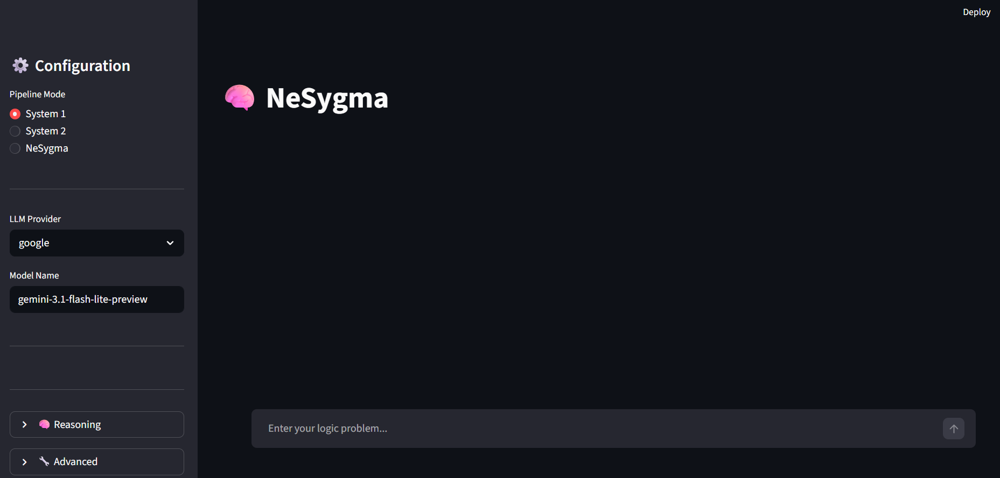
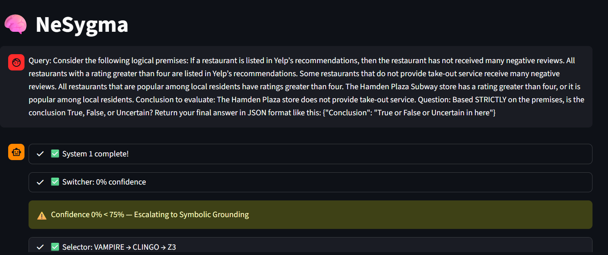
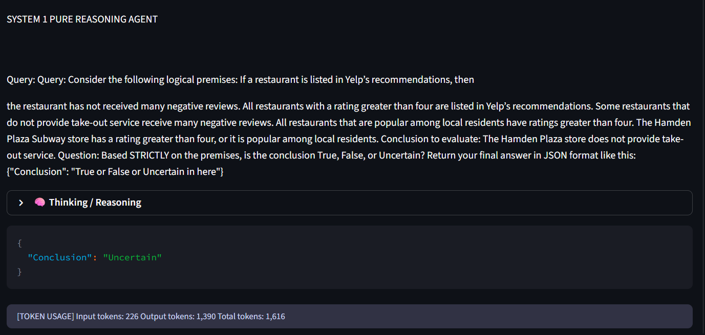
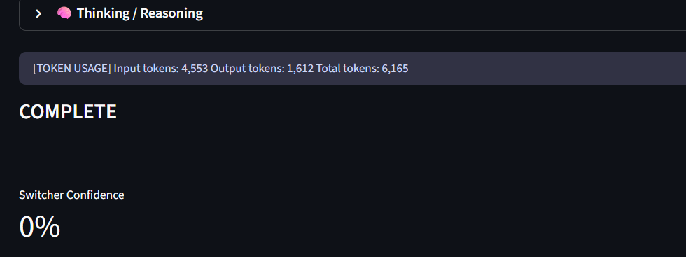
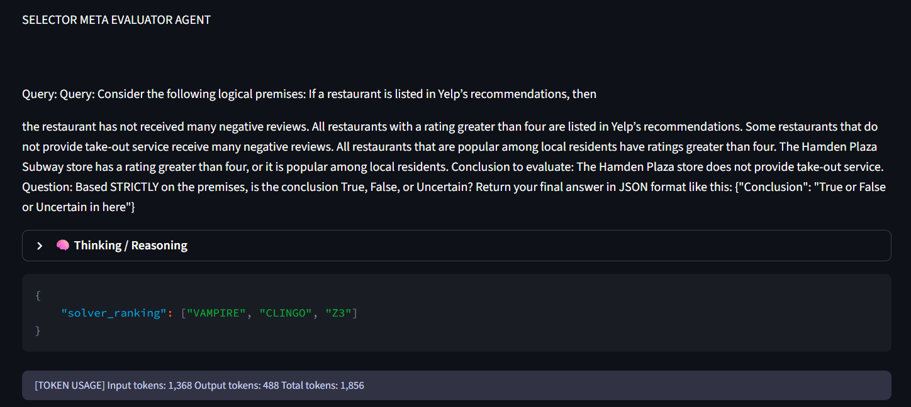
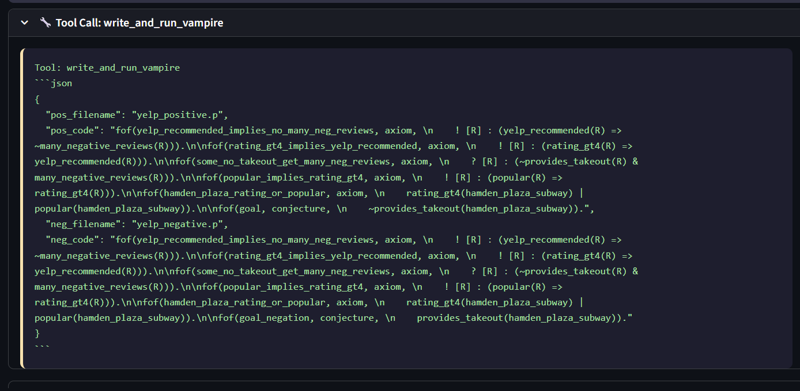
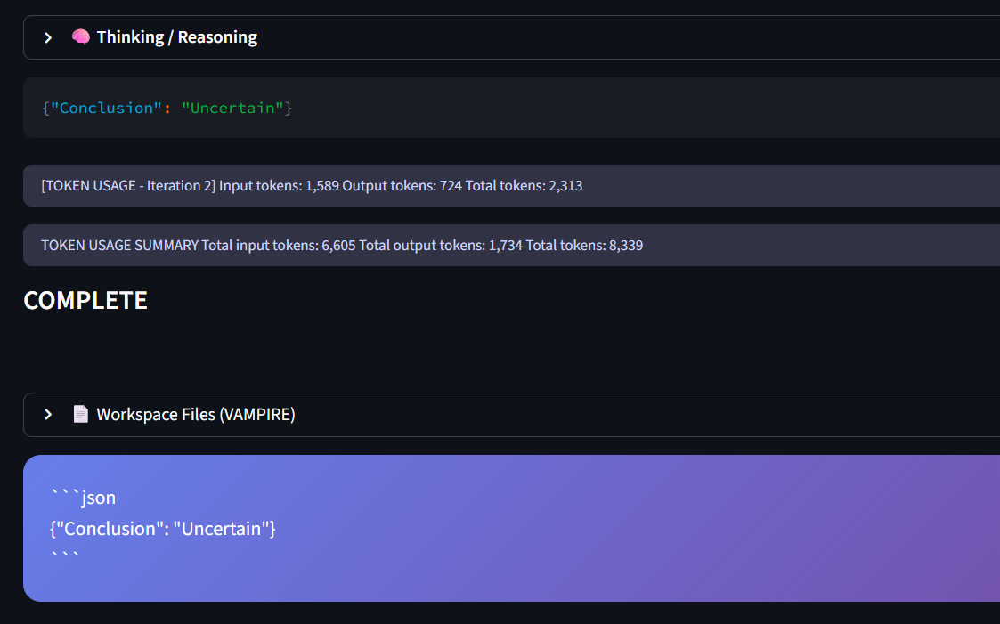

# NeSygma — Neuro-Symbolic with Metacognitive Evaluation and Adaptive Routing

A system that combines **Language Model** with **symbolic solver** (Clingo, Z3, Vampire) with metacognitive evaluation for formal logic problem solving.

Experimental results and evaluations are available in the [NeSygma-Result](https://github.com/NeSygma/Nesygma-Result) repository.

## Architecture

NeSygma is built upon the **dual-process theory** (inspired by Daniel Kahneman's *Thinking, Fast and Slow*), balancing the intuitive, fast reasoning of Large Language Models with the deliberative, rigorous accuracy of formal symbolic solvers. As a **neuro-symbolic** framework, it has  **4 specialized components** that collaborate to solve complex logic problems dynamically based on metacognitive confidence levels.

| Agent | Role | How It Works |
|-------|------|--------------|
| **System 1** | Pure LLM reasoning | Uses **Chain-of-Thought (CoT)** to quickly reason through problems step-by-step. Acts as the fast|
| **Switcher** | Metacognitive evaluator | Acts as the system's gatekeeper. It evaluates System 1's reasoning trace through a rigorous 5-stage protocol to prevent confirmation bias and overconfidence. If the confidence score falls below a threshold (e.g., 75%), it escalates the problem to the symbolic pipeline (System 2). |
| **Selector** | Solver ranking | When escalated, analyzes the problem structure and ranks the available symbolic solvers (Clingo, Z3, Vampire). This provides an automatic fallback mechanism if the top-ranked solver fails. |
| **MCP Agent** | Symbolic Solver | Translate natural languages problem into solver language that can be run by solver like Vampire, Clingo, or Z3. Answer problem using solver output |

### Pipeline Modes

The UI offers **3 pipeline modes**, each with a different level of reasoning sophistication:

```
┌─────────────────────────────────────────────────────────────────┐
│  System 1          │  Language Model                            │
│  System 2          │  Selector → MCP Agent                      │
│  NeSygma (full)    │  System 1 + Switcher → escalate if needed  │
└─────────────────────────────────────────────────────────────────┘
```

| Mode | Flow | When to Use |
|------|------|-------------|
| **System 1** | LLM reasons directly via Chain-of-Thought prompting. No solver involved. | Simple problems, quick answers, or when no solver is available. |
| **System 2** | Selector ranks solvers → MCP Agent tries them in ranked order with automatic fallback (`z3 → clingo → vampire`). | You want symbolic solver to answer your question |
| **NeSygma** | System 1 answers first → Switcher evaluates confidence → if **confidence < 75%**, escalate to Selector + MCP Agent. | Full pipeline: fast LLM answer first, symbolic solver only when uncertain. |

---

## Configuration & Modifying LLMs
If you need to add or modify an LLM provider, or change core generation parameters, you will need to edit three files:
1. `tests_benchmark/benchmark_config.py` - Sets default model names per provider, generation parameters (`max_output_tokens`, `temperature`, `top_p`), reasoning settings, and API key environment variable loading logic for the benchmarking suite.
2. `agent/config.py` - Defines the `LLMProvider` Enum and `PROVIDER_CONFIG` mapping (which maps each provider to its base API URL and expected API key environment variables).
3. `agent/llm_client.py` - Contains `LLMManager`, which handles the actual instantiation of LangChain models (`ChatDeepSeek`, `ChatGoogleGenerativeAI`, etc.) based on the provider.

---

## Benchmark Mode

The UI includes a **Benchmark Mode** toggle that changes how the system processes queries.

| Setting | Behavior |
|---------|----------|
| **Benchmark OFF** (default) | Normal interactive mode. The system runs the full pipeline and returns a natural-language answer.|
| **Benchmark ON** | Evaluation mode for running standardized logic benchmarks. The system processes queries in a format optimized for benchmark datasets (FOLIO, ASPBench, AGIEval LSAT). Solver output is parsed directly as the final answer without additional LLM interpretation. |

---
## Prerequisites

- Windows 11 with WSL2 enabled
- Anaconda (or Miniconda)
- WSL2 with Ubuntu (If in Linux/Macos doesnt need)

## Step-by-Step Setup

### Step 1: Install Anaconda

Download and install Anaconda from: https://www.anaconda.com/download

### Step 2: Create Conda Environment

```bash
conda create -n nesygma python=3.11
conda activate nesygma
```

### Step 3: Install Clingo (Potassco)

Clingo is the Answer Set Programming solver. Install it via conda:

```bash
conda install -c potassco clingo -y
```

Verify installation:

```bash
clingo --version
```

Ensure the version is **≥ 5.8.0**.

### Step 4: Install Python Dependencies

```bash
pip install -r requirements.txt
```

### Step 5: Install Vampire Theorem Prover

**For Linux and macOS (Apple Silicon/Intel) Users:**
Vampire runs natively. Simply download the correct binary, make it executable, and place it in your PATH:

1. Download Vampire Version 5.0.1 for your OS from: https://github.com/vprover/vampire/releases/tag/v5.0.1
2. Make it executable (`chmod +x vampire`) and move it to your system PATH (e.g. `/usr/local/bin/vampire`).
3. Verify the installation by running `vampire --version` in your terminal.

**For Windows Users:**
In this architecture, we use wsl for convenience and compatibility with the existing system.

**5a.** Open your WSL terminal:

```bash
wsl
```

**5b.** Download and install the Linux binary of Vampire inside WSL:
Vampire Version 5.0.1 — https://github.com/vprover/vampire/releases/tag/v5.0.1

**5c.** Verify the installation inside WSL:

```bash
vampire --version
```

**5d.** Exit the WSL terminal:

```bash
exit
```
### Step 6: Configure API Keys

Edit the `.env` file in the project root with your API keys. At minimum, set one provider:

```env
# Choose one or more:
OPENROUTER_API_KEY=your_key_here
GOOGLE_API_KEY=your_key_here
NVIDIA_API_KEY=your_key_here
MISTRAL_API_KEY=your_key_here
MIMO_API_KEY=your_key_here
```

### Step 7: Run the Application (UI or CLI)

**Run the Interactive UI:**

```bash
streamlit run app.py
```

The app will open at: **http://localhost:8501**

**Run via CLI (Benchmark Tests):**

You can also run tests from the command line using the testing script. See the available commands:

```bash
python tests_benchmark/test.py
```

## Project Structure

```
interactive_nesygma/
├── app.py                    # Main Streamlit application
├── ui/                       # Streamlit UI components
│   ├── config.py             # Config builder, provider models
│   ├── capture.py            # Streaming capture, output parsing
│   ├── workspace.py          # Workspace file management
│   ├── pipeline.py           # Async pipeline functions
│   ├── prompts.py            # Shared prompt templates
│   └── styles.py             # CSS styles
├── agent/                    # Core agent framework
│   ├── config.py             # MCPAgentConfig, LLMProvider
│   ├── llm_client.py         # LLM provider initialization
│   ├── mcp_core.py           # MCPAgent orchestrator
│   ├── phase_translator.py   # Translator phase facade (with MCP tools + refinement)
│   ├── phase_answer.py       # Answer phase 
│   ├── phase_prompts.py      # Solver-specific prompts
│   ├── single_pass_runner.py # Single-pass LLM streaming (imports utilities from translator package)
│   └── translator/           # Translator sub-package
│       ├── __init__.py       # Package entry point
│       ├── models.py         # PhaseUsage & TranslatorOutcome data schemas
│       └── utils.py          # Output parsing, reasoning extraction & solver validation
├── system1/                  # System 1 agent (CoT reasoning)
│   ├── system1_core.py       # System 1 logic
│   └── prompts.py            # CoT prompt templates
├── selector/                 # Selector agent (solver ranking)
│   ├── selector_core.py      # Selector logic
│   └── prompts.py            # Selector prompts
├── switcher/                 # Switcher agent (adversarial evaluator)
│   ├── switcher_core.py      # Switcher logic
│   └── prompts.py            # Switcher prompts
├── clingo_mcp_server/        # Clingo MCP server
│   ├── clingo_logic.py       # Clingo execution logic
│   ├── tools.py              # MCP tool definitions
│   └── prompts.py            # Clingo-specific prompts
├── z3_mcp_server/            # Z3 MCP server
│   ├── z3_logic.py           # Z3 execution logic
│   ├── tools.py              # MCP tool definitions
│   └── prompts.py            # Z3-specific prompts
├── vampire_mcp_server/       # Vampire MCP server
│   ├── vampire_logic.py      # Vampire execution logic
│   ├── tools.py              # MCP tool definitions
│   └── prompts.py            # Vampire-specific prompts
├── tests/                    # Unit tests
├── tests_benchmark/          # Benchmark execution scripts
│   ├── benchmark_config.py   # Configuration and argparser logic
│   ├── benchmark_loaders.py  # Prompt templates and problem loading functions
│   ├── benchmark_validators.py# Verification and output extraction functions
│   ├── benchmark_output.py   # Output logging, report saving & workspace management
│   ├── benchmark_utils.py    # Backwards-compatible facade module re-exporting the utilities
│   ├── test.py               # CLI benchmark execution launcher
│   └── test_*.py             # Specialized pipeline mode run scripts (system1, mcp, switcher, selector)
├── Benchmark/                # Contains all benchmark dataset files used for evaluation
├── .env                      # API keys (not committed)
└── requirements.txt          # Python dependencies
```

---

## Supported Providers

| Provider | Default Model |
|----------|---------------|
| Google | `gemini-3.1-flash-lite` |
| NVIDIA | `nvidia/nemotron-3-nano-30b-a3b` |
| OpenRouter | `openai/gpt-oss-120b` |
| Mistral | `mistral-small-2603` |
| Xiaomi | `mimo-v2.5-pro` |

## Supported Solvers

| Solver | Type | Best For |
|--------|------|----------|
| **Clingo** | Answer Set Programming | Combinatorial search, planning, rule-based inference |
| **Z3** | SMT Solver | Constraint satisfaction problem|
| **Vampire** | Automated Theorem Prover | First-order logic problem |

---

## Interactive UI







